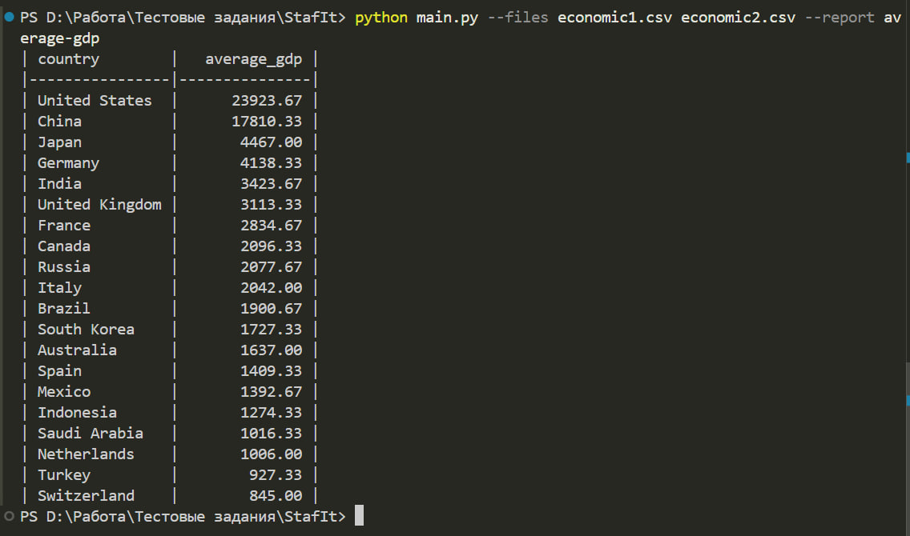
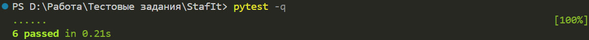

# StafIt: анализ макроэкономических данных

Небольшой CLI-скрипт читает один или несколько CSV-файлов с макроэкономическими данными и формирует отчёт в консоли.
Сейчас реализован отчёт `average-gdp`: среднее арифметическое по колонке `gdp` для каждой страны, отсортированное по убыванию.

## Запуск

```bash
python main.py --files economic1.csv economic2.csv --report average-gdp
```

## Пример работы



## Тесты

```bash
pytest -q
```



## Как добавить новый отчёт

1. Создать модуль в `stafit/reports/` с классом и методом `build(rows)`.
2. Добавить экземпляр отчёта в реестр `stafit/reports/registry.py`.
3. Добавить тесты для нового отчёта.
